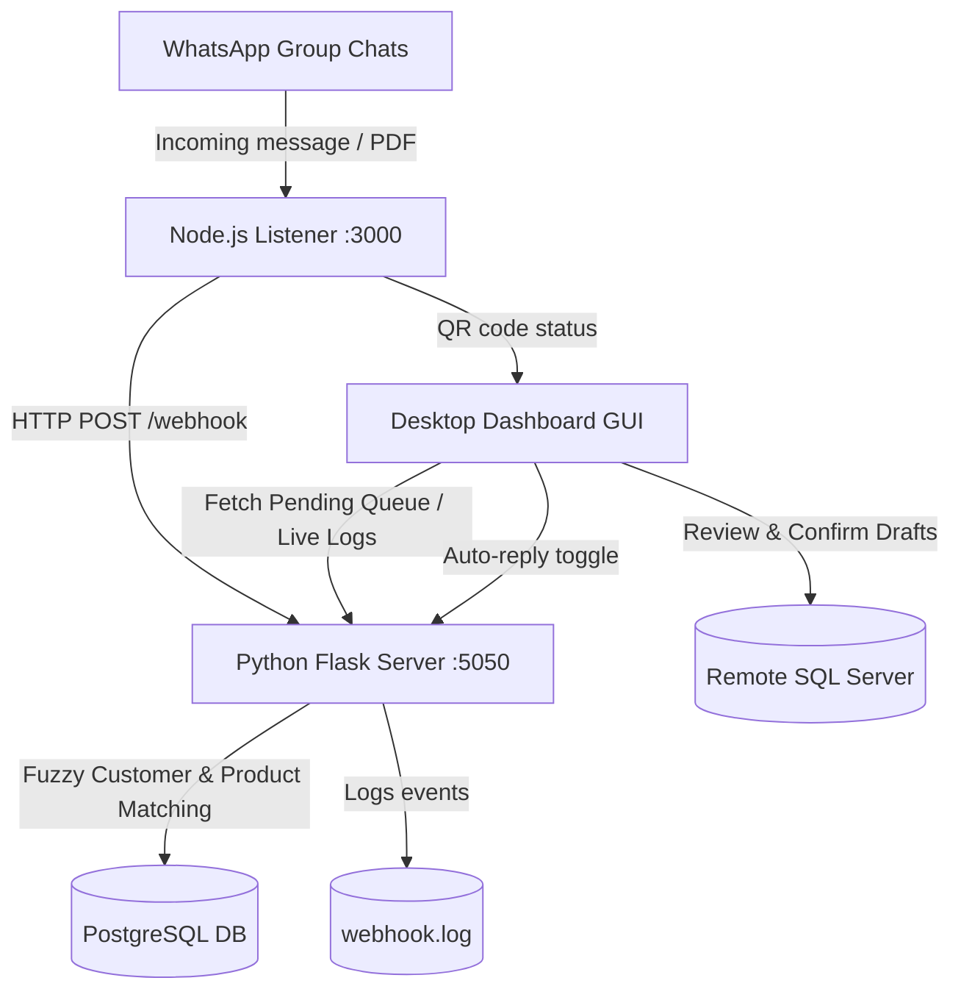

# 💬 WhatsApp Order Bot & Dashboard

An automated, intelligent sales assistant that listens to incoming WhatsApp messages and purchase order PDFs, extracts customer and product lines using advanced fuzzy matching heuristics, and provides a sleek desktop GUI for human verification before pushing order drafts directly into a live MS SQL Server database.

---

## 🚀 Key Features

* **One-Click Setup & Launch**: Unified launcher (`SAPI_WATCHER.bat`) that checks for repository updates from GitHub, verifies system dependencies, runs library checks, and starts the CustomTkinter desktop GUI.
* **Real-time WhatsApp Listener**: Uses `whatsapp-web.js` to securely intercept messages from designated chat groups.
* **PDF Purchase Order Ingestion**: Automatically extracts text from attached PDF purchase orders using PyMuPDF and processes them through the same matching pipeline as text messages.
* **Intelligent Parsing & Matching**:
  * Normalizes bilingual customer messages (Spanish and English).
  * Performs multi-pass customer identification (exact/fuzzy match, phone number lookup).
  * Automatically matches product catalog items using historical order preferences and fuzzy string overlap.
  * Retrieves customer-specific tiered pricing from SQL Server price lists (Price, Price1, Price2 tiers).
* **Interactive Desktop Dashboard**:
  * Real-time metrics display (Orders Today, Needs Review, Customers, Products).
  * Service health indicators for Flask, Node.js, MSSQL, and PostgreSQL.
  * **Order Reviewer**: Expandable order cards with original WhatsApp message preview, line-item details (product, SKU, cases, lbs, totals), and one-click Confirm / Edit / Reject actions.
  * **Full Edit Dialog**: Inline product search with autocomplete, per-line quantity editing with automatic lbs calculation, line deletion, per-line notes, customer detail overrides (address, payment terms, delivery terms, salesman), and special instructions.
  * **Direct Order Entry**: Submit text orders or attach purchase order PDFs manually via the dashboard.
  * **Auto-Reply Toggle**: Pause/resume automatic WhatsApp reply messages without stopping order processing — orders are still saved locally when paused.
  * **QR Code Popup**: On first run (or re-authentication), a dedicated popup window displays the WhatsApp QR code for scanning directly inside the dashboard.
  * WhatsApp chat group monitor selection.
  * Live log terminal with pause/resume.
  * In-app Connection/Environment Settings panel (writes directly to `.env`).
* **MSSQL Customer Pre-fill**: When confirming an order, the system pulls the customer's full profile from SQL Server (name, address, tax ID, payment/delivery terms, salesman) and populates the sales order header automatically.

---

## 🛠 Architecture



**Flow summary:**
1. WhatsApp messages (and PDF attachments) arrive at the **Node.js listener**.
2. The listener forwards them to the **Flask webhook**, which parses the message, matches customers and products, and saves draft order lines to **PostgreSQL**.
3. The **Dashboard** polls Flask for pending orders and displays them for human review.
4. On confirmation, the order is pushed to the **remote SQL Server** with full customer pre-fill and tiered pricing.

---

## 📦 Prerequisites

* **Operating System**: Windows 10 or Windows 11.
* **WhatsApp**: A smartphone with WhatsApp installed to scan the QR code.

> 💡 All other dependencies (Python, Node.js, PostgreSQL, ODBC drivers) are installed automatically by the setup assistant if missing.

---

## ⏱️ Quick Start Guide

### Step 1: Automated Setup & Launch
Double-click **`SAPI_WATCHER.bat`** in the project root folder.
* This launcher checks for repository updates from GitHub.
* If any prerequisites (Python, Node.js, PostgreSQL, SQL Server ODBC drivers, or `.env`) are missing, it automatically launches the elevated setup assistant to install them.
* On every launch, it installs/updates any missing Python packages and Node.js dependencies.
* Finally, it starts the SAPI_WATCHER Desktop Dashboard.
* To place a shortcut named `SAPI_WATCHER` with a green chat icon on your Desktop, run `src/create_shortcut.bat`.

> 💡 *Note: During PostgreSQL installation (if PostgreSQL is not already installed), follow the graphical installer prompts. We recommend setting your database password to `openpgpwd` (or update it in settings later).*

### Step 2: Configure Settings
Once the dashboard opens:
1. On the launch screen, click **⚙ Connection Settings**.
2. Configure your local PostgreSQL credentials and remote SQL Server connection string.
3. Click **Save Settings** to write changes to your `.env` file.

### Step 3: Scan the WhatsApp QR Code
1. Click **Connect to SQL Server** on the launch screen.
2. If this is your first run, a **QR code popup window** will appear inside the dashboard.
3. Open WhatsApp on your phone → **Linked Devices** → **Link a Device** and scan the QR code.
4. Once authenticated, your session is saved locally in `whatsapp_session/` — you will not need to scan again.

### Step 4: Run the Bot
The dashboard will open automatically. Both backend services (Flask Webhook on port `5050` and Node Listener on port `3000`) are started and managed by the dashboard — closing the dashboard stops all services.

---

## 📂 Project Structure

To keep the workspace clean, only the launcher script, local configurations, database/log files, and the WhatsApp receiver remain in the root directory. All system internals, setups, and other dependencies are stored in the `src/` folder:

```text
WhatsAppOrder/
│
├── SAPI_WATCHER.bat         # Unified launcher (update check + dependencies check + app launch)
├── WhatsAppRecieve.py       # WhatsApp message downloader and manual CLI watcher
├── README.md                # Project overview and introduction (this file)
│
├── .env                     # Local runtime configuration (git-ignored)
├── whatsapp_orders.db       # Local database file (used only for offline/fallback cache)
├── webhook.log              # App runtime log output file
├── agent_output.txt         # Debug output from sales agent processing
├── PDF_TEST/                # Test PDF files for purchase order ingestion testing
│
└── src/                     # Core system source files
    ├── .env.example         # Clean environment variables configuration template
    ├── SETUP.md             # Detailed setup and troubleshooting documentation
    ├── requirements.txt     # Python libraries list
    ├── package.json         # Node.js service dependencies
    │
    ├── dashboard.py         # CustomTkinter GUI App — layout, tabs, order review, edit dialog
    ├── whatsapp_webhook.py  # Python Flask backend — webhook, order processing, dashboard API
    ├── whatsapp_listener.js # Node.js whatsapp-web.js connector — message relay & QR serving
    ├── whatsapp_sales_agent.py # NLP & Fuzzy item/customer match logic
    ├── db_setup.py          # Database initializer and remote MS SQL syncer
    │
    ├── setup_prerequisites.ps1 # Elevated setup script (installs Python, Node, PostgreSQL, ODBC)
    ├── create_shortcut.bat  # Creates SAPI_WATCHER shortcut on the Desktop
    ├── DASHBOARD.bat        # Alternative launcher — starts dashboard.py directly
    ├── START.bat            # Alternative launcher — starts backend services
    │
    ├── auto_replies_state.json # Persisted auto-reply pause/resume state
    │
    ├── db_browser.py        # Utility — browse local PostgreSQL tables
    ├── simulate_webhook.py  # Test tool — simulate incoming webhook messages
    ├── clear_test_data.py   # Test tool — clear test data from local database
    ├── test_matching.py     # Unit tests — customer and product matching logic
    ├── test_webhook.py      # Unit tests — webhook endpoint behavior
    ├── scratch_parser.py    # Scratch — message parser experiments
    ├── scratch_price.py     # Scratch — pricing logic experiments
    └── scratch_sql.py       # Scratch — SQL query experiments
```

---

## ⚙️ Environment Variables

The project reads configurations from `.env` in the root folder. Available variables:

| Variable | Description | Default |
|---|---|---|
| `DB_HOST` | Local PostgreSQL Host | `localhost` |
| `DB_PORT` | Local PostgreSQL Port | `5432` |
| `DB_NAME` | Local PostgreSQL Database Name | `whatsapp_orders` |
| `DB_USER` | Local PostgreSQL Username | `postgres` |
| `DB_PASSWORD` | Local PostgreSQL Password | `openpgpwd` |
| `PUSH_TO_MSSQL` | Enable pushing finalized orders directly to production SQL | `False` |
| `MSSQL_CONN_STR` | ODBC Connection String for remote MS SQL Server | *(See `src/.env.example`)* |
| `WHATSAPP_API_KEY` | Meta Cloud API key *(optional — only for Cloud API mode)* | — |
| `WHATSAPP_PHONE_NUMBER_ID` | Meta Cloud API phone number ID *(optional)* | — |
| `FLASK_SECRET_KEY` | Flask session secret key | `wa-order-bot-secret-2024` |

---

## 📚 Dependencies

### Python (`src/requirements.txt`)
| Package | Purpose |
|---|---|
| `flask` | HTTP backend server |
| `python-dotenv` | `.env` file loading |
| `psycopg2-binary` | PostgreSQL driver |
| `requests` | HTTP client for inter-service calls |
| `pyodbc` | SQL Server ODBC driver |
| `customtkinter` | Modern desktop GUI framework |
| `PyMuPDF` *(optional)* | PDF text extraction for purchase order attachments |

### Node.js (`src/package.json`)
| Package | Purpose |
|---|---|
| `whatsapp-web.js` | WhatsApp Web client library |
| `express` | HTTP server for listener endpoints |
| `axios` | HTTP client for webhook forwarding |
| `qrcode-terminal` | QR code rendering in terminal (fallback) |
