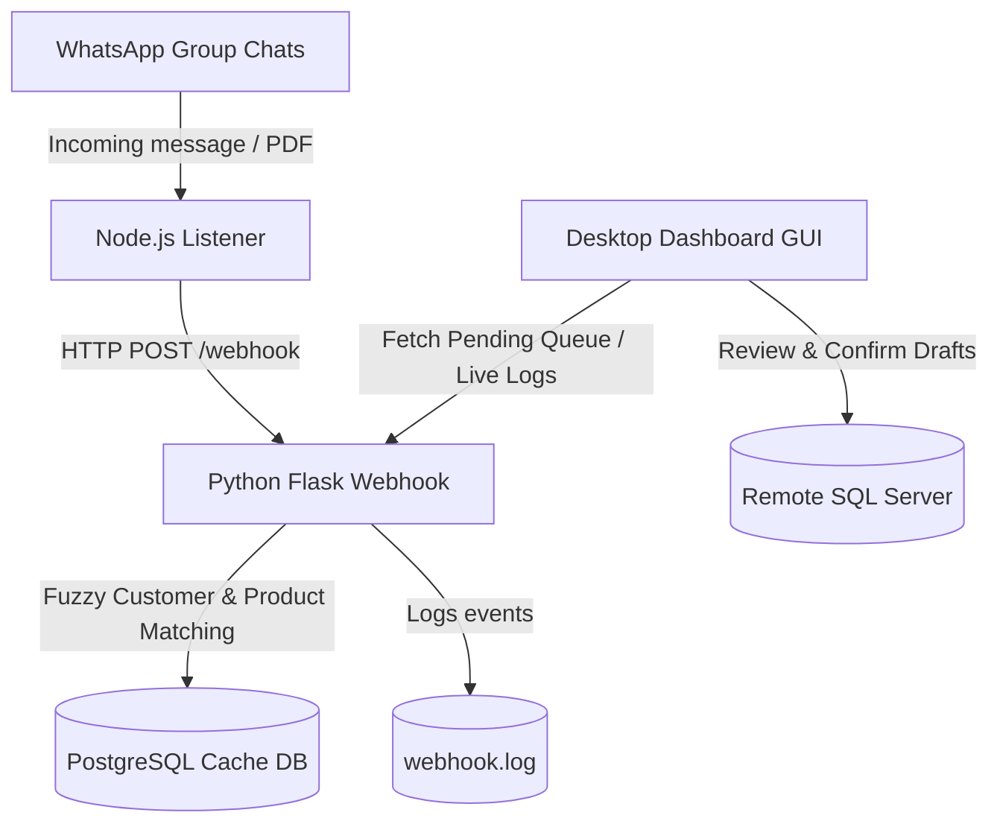

# 💬 WhatsApp Order Bot & Dashboard

An automated, intelligent sales assistant that listens to incoming WhatsApp messages and purchase order PDFs, extracts customer and product lines using advanced fuzzy matching heuristics, and provides a sleek desktop GUI for human verification before pushing order drafts directly into a live MS SQL Server database.

---

## 🚀 Key Features

* **One-Click Setup**: Automated setup script (`EASY_SETUP.bat`) that verifies, downloads, and installs system dependencies (Python, Node.js, PostgreSQL, SQL Server ODBC drivers) using Windows Package Manager (`winget`).
* **Real-time WhatsApp Listener**: Uses `whatsapp-web.js` to securely intercept messages from designated chat groups.
* **Intelligent Parsing & Matching**:
  * Normalizes bilingual customer messages (Spanish and English).
  * Performs multi-pass customer identification (exact/fuzzy match).
  * Automatically matches product catalog items using historical order preferences and fuzzy string overlap.
* **Interactive Desktop Dashboard**:
  * Real-time metrics display (Orders Today, Pending, Active Products/Customers).
  * Full-featured Order Reviewer (Edit order lines, adjust quantities, override shipping/payment terms, confirm/reject).
  * Direct Order Entry (submit text orders or attach purchase order PDFs manually).
  * WhatsApp chat monitor selection.
  * Live log terminal.
  * In-app Connection/Environment Settings panel (writes directly to `.env`).

---

## 🛠 Architecture



---

## 📦 Prerequisites

* **Operating System**: Windows 10 or Windows 11.
* **WhatsApp**: A smartphone with WhatsApp installed to scan the QR code.

---

## ⏱️ Quick Start Guide

### Step 1: Automated Installation (One-time)
Double-click **`EASY_SETUP.bat`** in the project root folder.
* This script will request administrative permissions to run a PowerShell installer.
* It checks if Python, Node.js, PostgreSQL, and ODBC drivers are installed. If missing, it will install them automatically via `winget`.
* It installs all required python libraries and npm packages.
* It initializes a local database cache (`whatsapp_orders`).
* Finally, it places a shortcut launcher named **WhatsApp Order Bot** on your desktop.

> 💡 *Note: During PostgreSQL installation, follow the graphical installer prompts. We recommend setting your database password to `openpgpwd` (or update it in settings later).*

### Step 2: Configure Settings
Launch the bot from your Desktop shortcut or double-click **`DASHBOARD.bat`**. 
1. On the launch screen, click **⚙ Connection Settings**.
2. Configure your local PostgreSQL credentials and remote SQL Server connection string.
3. Click **Save Settings** to write changes to your `.env` file.

### Step 3: Scan the WhatsApp QR Code
1. Click **Connect to SQL Server** on the launch screen.
2. If this is your first run, a color-coded terminal will print a **WhatsApp QR Code**.
3. Open WhatsApp on your phone → **Linked Devices** → **Link a Device** and scan the QR code.
4. Once authenticated, your session is saved locally in `whatsapp_session/` — you will not need to scan again.

### Step 4: Run the Bot
The dashboard will open automatically. Ensure both backend services (Flask Webhook on port `5050` and Node Listener on port `3000`) remain running in the background. Minimize the dashboard to keep the bot monitoring groups.

---

## 📂 Project Structure

To keep the workspace clean, all system internals are grouped inside the `src/` folder:

```text
WhatsAppOrder/
│
├── EASY_SETUP.bat           # One-click UAC elevated prerequisites installer
├── DASHBOARD.bat            # Launches the CustomTkinter GUI Desktop app
├── START.bat                # Direct services launcher (alternative to GUI)
├── SETUP.md                 # Detailed step-by-step setup documentation
├── README.md                # Project overview and introduction (this file)
│
├── .env.example             # Clean environment variables configuration template
├── .env                     # Local runtime configuration (git-ignored)
├── requirements.txt         # Python library list
├── package.json             # Node.js service dependencies
│
└── src/                     # Core system source files (not to be edited by end-users)
    ├── dashboard.py         # CustomTkinter GUI App layout and logic
    ├── whatsapp_webhook.py  # Python Flask backend listener
    ├── whatsapp_listener.js # Node.js whatsapp-web.js connector
    ├── whatsapp_sales_agent.py # NLP & Fuzzy item/customer match logic
    ├── db_setup.py          # Database initializer and remote MS SQL syncer
    └── [utilities/tests]    # db_browser.py, test scripts, and parser tools
```

---

## ⚙️ Environment Variables

The project reads configurations from `.env` in the root folder. Available variables:

| Variable | Description | Default |
|---|---|---|
| `DB_HOST` | Local PostgreSQL Host | `localhost` |
| `DB_PORT` | Local PostgreSQL Port | `5432` |
| `DB_NAME` | Local PostgreSQL Database Name | `whatsapp_orders` |
| `DB_USER` | Local PostgreSQL Username | `openpg` |
| `DB_PASSWORD` | Local PostgreSQL Password | `openpgpwd` |
| `PUSH_TO_MSSQL` | Enable pushing finalized orders directly to production SQL | `True` |
| `MSSQL_CONN_STR` | ODBC Connection String for remote MS SQL server | *(See .env.example)* |
